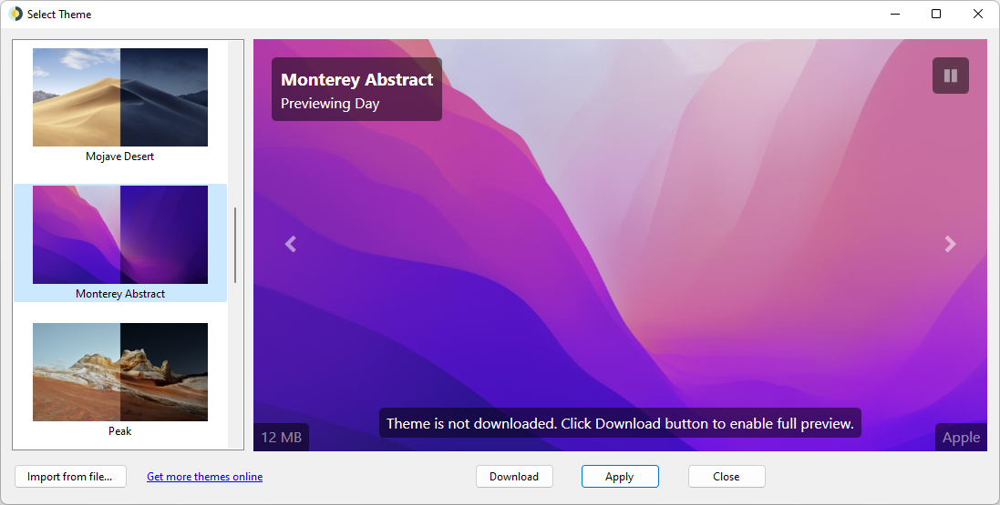
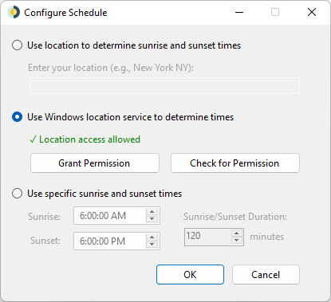

 

# WinDynamicDesktop
Puerto de la función de escritorio dinámico de macOS Mojave a Windows 10. Disponible en GitHub y Microsoft Store. https://github.com/MordooDs/WinDynamicDesktop/releases/download/untagged-6263b3e84e6bf98e299f/WinDynamicDesktop_5.0.1_x64_Setup.exe

## Temas

Elija cualquiera de los temas incluidos con macOS, o muchos más temas disponibles para descargar [aquí](https://windd.info/themes/).

## Schedule

Elija un horario para recorrer imágenes de fondo de pantalla durante 24 horas

## Dispositivos Compatibles

WinDynamicDesktop está desarrollado principalmente para Windows 10, pero debe ejecutarse en cualquier versión de Windows con .NET Framework 4.5 o posterior instalado. Si su versión de .NET Framework es demasiado antigua, puede instalar una más nueva desde [aquí](https://www.microsoft.com/net/download).

## Recursos

* [Ayuda](https://github.com/t1m0thyj/WinDynamicDesktop/wiki)
* [Descarga Temas](https://windd.info/themes/)
* [Descarga Scripts](https://windd.info/scripts/)
* [Traduce en POEditor](https://poeditor.com/join/project/DEgfVpyuiK)
* [.ddw Creador de Temas](https://ddw-theme-creator.vercel.app/) (gracias @gdstewart)

## Problemas Conocidos

* [Ajuste de papel tapiz no recordado en la aplicación Microsoft Store](https://github.com/t1m0thyj/WinDynamicDesktop/wiki/Known-issues#wallpaper-fit-not-saved-with-multiple-monitors)
* [El fondo de pantalla se atasca y no se actualiza](https://github.com/t1m0thyj/WinDynamicDesktop/wiki/Known-issues#wallpaper-gets-stuck-and-wont-update)

## Limitaciones
* [No se pueden mostrar imágenes separadas en múltiples escritorios virtuales](https://github.com/t1m0thyj/WinDynamicDesktop/issues/299)

## Créditos

* Las imágenes de fondo de pantalla no son de mi propiedad, pertenecen a Apple
* [LocationIQ API](https://locationiq.org/) se usa cuando ingresa su ubicación, para convertirla a latitud y longitud
* La aplicación Microsoft Store usa la API de ubicación de Windows si se otorga el permiso
* Icono de la app creado por [Roundicons](https://www.flaticon.com/authors/roundicons) de [flaticon.com](https://www.flaticon.com/) y es licenciado por [CC 3.0 BY](http://creativecommons.org/licenses/by/3.0/)

* Creado por Mordoo. Discord: Mordoo#1695
